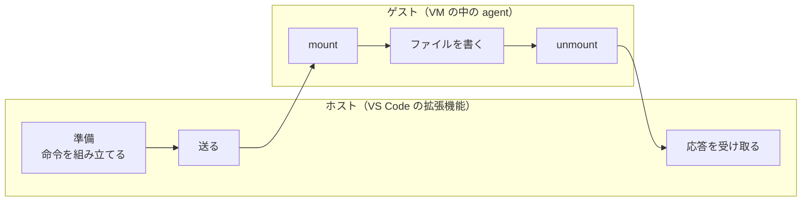
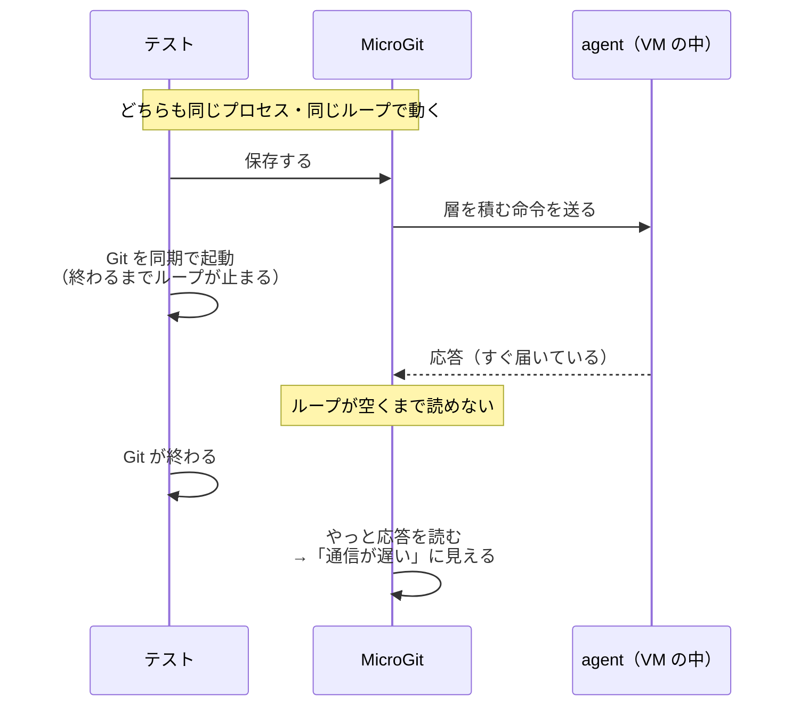
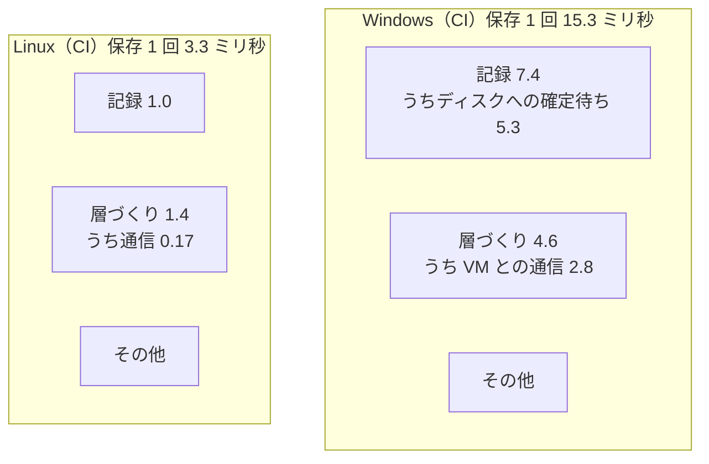

ファイルを保存するたびに裏で自動コミットを作り、あとから好きな時点に戻せる VS Code 拡張「**MicroGit**」を、大学で個人開発しています。

5.0.0 から、MicroGit は拡張機能の中に小さな Linux を入れて、Linux カーネルの OverlayFS という機能で「過去に戻る」を速くしています（[前の記事](https://zenn.dev/usudonsdev/articles/microgit-v5-kernel-overlay)）。Windows や Mac では、その Linux を仮想マシン（以下 VM）として裏で動かします。

次に速くするなら、この VM を小さくしよう。そう考えて、カーネルの設定を削る候補を洗い出していました。ところが、保存の処理を順に測っていくと、**遅く見えていた時間の大半は、計測に使っていた自分のテストが作っていました。**

:::message
**この記事で書くこと**
- 「VM を小さくすれば速くなる」という前提を、測って確かめ直した話
- 「VM との通信が遅い」に見えた 30 ミリ秒が、実はテストが Git を同期で起動していた待ちだったこと
- 同じものを VS Code の外と中で測ると、混ざりものが見つかること
- テストを直したあとの本当の値と、カーネル版と旧方式（Node.js 版）の比較

VS Code 拡張を作っている人、拡張機能テストで速さを測っている人向けです。
:::

1 ミリ秒は 0.001 秒です。この記事の数字は、何十回か測った真ん中の値（中央値）です。

---

## 前提：起動が遅いから、VM を小さくする

MicroGit の保存の処理は、大きく 2 つに分かれます。

| 段階 | すること |
| --- | --- |
| 記録 | 保存した中身を、Git の形式で隠しリポジトリに残す |
| 層づくり | あとで速く戻れるように、VM の中の OverlayFS に「層」を 1 枚積む |

VM を小さくしようとしていたのは、「VM の起動に時間がかかり、それが全体を遅くしている」と考えていたからです。

ところが、保存の処理のコードを読み直すと、起動はすでに隠れていました。VM がまだ起動していなければ、最初の保存のときに裏で起動を始め、その回の層は旧方式で作ります。利用者が起動を待つのは、起動しきる前に「過去に戻る」を押したときだけです。

起動ではないなら、どこが遅いのか。以前の計測では、「保存の処理の中でいちばん重いのは層づくり」と分かっていました。Windows で 35 ミリ秒、記録の 1.7 倍です。ただ、層づくりの中身は測っていませんでした。

---

## 層づくりの中を測る

層づくりを、手元の PC（ホスト）側と VM の中（ゲスト）側の両方で、段階に分けて測りました。

ゲストの中の agent（命令を受けて実行するプログラム）には、各段階の時間を応答に入れて返すようにしました。ホスト側では往復の時間を測り、そこからゲストの中の時間を引いたものを「通信」とします。

GitHub Actions の自動テスト用のパソコン（以下 CI）で、保存を 100 回繰り返して測った結果です。

| パソコン（CI） | 層づくり | うち通信 | うちゲストの中 | うち mount | うち unmount |
| --- | --- | --- | --- | --- | --- |
| Windows（VM あり） | 33.7 ミリ秒 | 32.0 | 0.95 | 0.15 | 0.05 |
| Linux（VM なし） | 9.5 ミリ秒 | 8.1 | 1.2 | 0.30 | 0.16 |

ゲストの中は 1 ミリ秒前後で、OverlayFS の mount と unmount はどちらも 0.3 ミリ秒以下でした。層づくりの 8〜9 割は「通信」です。

この時点で、VM を小さくする案は効かないと分かりました。VM の中の仕事はもともと小さいからです。では次は、VM とのデータの出入りを速くする番か。そう考えかけて、引っかかりました。

**Linux では VM を使っていません。** 拡張機能と agent は、同じ PC の上でパイプ（プログラム同士の通り道）でつながっているだけです。それなのに、通信に 8 ミリ秒かかっています。パイプの往復としては長すぎます。

---

## 外で測ると 0.12 ミリ秒

同じ往復を、VS Code の外で測りました。拡張機能が使っているのと同じ接続のコードで agent を起動し、同じくらいの大きさ（約 250 バイト）のファイルを 300 回送ります。

| 測った場所 | 通信 |
| --- | --- |
| VS Code の外（Linux、VM なし） | **0.12 ミリ秒** |
| VS Code の中（Linux、VM なし、CI） | 8.1 ミリ秒 |

60 倍以上違います。パイプが遅いのではなく、VS Code の中で何かが起きています。

そこで、通信をさらに 3 つに分けました。

| 名前 | 中身 |
| --- | --- |
| 送信 | 命令を組み立てて書き出すまで |
| 配達 | 書き出してから、応答が届くまで |
| 再開 | 応答が届いてから、待っていた処理に戻るまで |

あわせて、往復のあいだに **拡張機能のプロセスが手を空けていたか** も測りました。Node.js は 1 つのループで順番に仕事をこなすので、誰かが重い仕事を同期で（終わるまで手放さずに）していると、ほかの仕事は全部待たされます。往復のあいだ、ループが 1 周するたびに印を付け、印と印のすき間を測ります。

| パソコン（CI） | 層づくり | 配達 | 再開 | ループのいちばん長いすき間 |
| --- | --- | --- | --- | --- |
| Windows | 25.0 ミリ秒 | 24.0 | 0.06 | **24.4** |
| Linux | 3.9 ミリ秒 | 3.0 | 0.04 | **3.7** |

通信のほとんどが「配達」で、そのあいだ **ループは 1 回の長い仕事でずっとふさがれていました。** agent はすぐに答えているのに、拡張機能のプロセスが別の仕事で手いっぱいで、届いた応答を読めていなかったのです。

---

## ふさいでいたのは、自分のテストだった

CI のテストでは、組み込みの Git 拡張も含めて、ほかの拡張機能はすべて止めています。残っているのは MicroGit と、テストそのものだけです。

テストの「ファイルを書き換えて保存する」手順を読み直して、見つけました。保存したあと、本当に記録ができたかを確かめるために、テストが **Git のプログラムを同期で起動していました**（Node.js の `execFileSync`）。

ここで効いてくるのが、VS Code の拡張機能テストは **拡張機能と同じプロセスの中で動く** という点です。テストが Git の終わりを待っているあいだ、同じループで動く MicroGit も止まります。

Git のプログラムの起動には、Windows で 30〜40 ミリ秒、Linux でも数ミリ秒かかります。測っていた「通信」の大きさと、ぴったり合います。**利用者がふだん保存するときには、このテストは動いていません。** 計測の道具が、測られる側の時間に混ざっていました。

---

## 直して測り直す

テストを 2 段階で直しました。

1. Git の起動を、同期（`execFileSync`）から非同期（`execFile`）にする
2. それでも Linux では数ミリ秒残ったので、保存の最中は Git を一切起動しないようにする。代わりに、MicroGit から「処理を終えた保存の数」と「最後のコミット」を教えてもらう

1 で残ったのは、子プロセスを起動する瞬間の分です。非同期にしても、プロセスを作るところだけは同期で動きます。Linux では、子プロセスを作るときに親のプロセス（ここでは VS Code の拡張機能のプロセス）を複製する処理が入ります。親が大きいほど時間がかかり、そこで数ミリ秒止まったと見ています（この部分の内訳は測っていません）。

手元の Windows で、同じ拡張機能のパッケージを使って比べました。

| 手元の Windows | 直す前 | 1 のあと | 2 のあと |
| --- | --- | --- | --- |
| 層づくり | 40.4 ミリ秒 | 3.7 | **2.0** |
| うち通信 | 39.9 ミリ秒 | 3.1 | **1.4** |
| ループがふさがれていた時間 | 40.2 ミリ秒 | 3.3 | **0.0** |
| 保存 1 回の処理全体 | — | 9.5 | **7.3** |

2 のあと、ループはほぼ空くようになりました。拡張機能テストの実行時間も、1 分から 21 秒に縮みました。

CI の 5 台でも測り直しています。

| パソコン（CI） | 保存 1 回の処理全体（直す前 → 後） | 層づくり（直す前 → 後） | うち通信 |
| --- | --- | --- | --- |
| Linux（VM なし） | 5.9 → **3.3** ミリ秒 | 3.9 → 1.4 | 0.17 |
| Linux arm（VM なし） | 10.7 → **3.7** ミリ秒 | 7.1 → 1.4 | 0.23 |
| Windows（VM あり） | 33.3 → **15.3** ミリ秒 | 25.0 → 4.6 | 2.78 |

Linux の通信は 0.2 ミリ秒前後になり、VS Code の外で測った値とそろいました。これで、混ざりものは取れたと判断しています。

<!-- 計測：2026-10-09。CI は package.yml（run 37819226341＝直す前、37824014250＝直した後）、保存 100 回の最後の 50 回の中央値。手元は Windows 11・AMD Ryzen 7 5700X、保存 100 回の最後の 20 回の中央値（docs/paper/data/local-win-61/）。VS Code の外は scripts/bench-agent-rtt.mjs（計測用ブランチ measure/61-layer-breakdown）。 -->

---

## 本当の値で見ると

テストを直したあとの値で、分かったことをまとめます。

- **VM の大きさや起動、OverlayFS の mount は、保存の速さを決めていません。** VM の中の仕事は 1 ミリ秒前後です
- **VM とのデータの出入りにかかる本当の時間** は、Windows で約 2.8 ミリ秒、Linux（VM なし）で約 0.2 ミリ秒です。Windows ではゼロではありませんが、小さい部類です
- Windows の CI でいちばん大きいのは、記録のときの「ディスクへの確定待ち」（fsync）でした。CI の仮想マシンのディスクは確定が遅く、手元の PC ではもっと小さくなります

保存 1 回の処理を 16 ミリ秒以下に収める、というのが MicroGit の目安です（人が遅れに気づきにくい範囲の目安として決めた予算です）。Linux と手元の Windows では、すでに収まっています。

---

## カーネル版は、旧方式より速くなったのか

もう 1 つ確かめたかったのが、VM を使う新方式（カーネル版）は、速くしてきた旧方式（Node.js 版）より本当に速いのか、です。CI では 2 つの方式が別のパソコンで動くので、手元の Windows で設定を切り替えて、同じ条件で比べました。

| 手元の Windows | カーネル版 | 旧方式（Node.js 版） |
| --- | --- | --- |
| 保存 1 回の処理全体 | **7.3 ミリ秒** | 165.3 ミリ秒 |
| うち層づくり | 2.0 ミリ秒 | 157.1 ミリ秒 |
| 過去に戻る操作 | **0.51 秒** | 5.06 秒 |

保存で約 23 倍、過去に戻る操作で約 10 倍、カーネル版が速くなりました。差のほとんどは層づくりです。旧方式は、保存のたびに Git のプログラムを何回か同期で起動して、層を書き出しています。カーネル版は、記録の処理がすでに知っている「何が変わったか」をそのまま VM に渡すので、Git を起動しません。

ただし、これは 1 台の Windows での比較です。また、ここでの「過去に戻る操作」はテストのコマンド全体の時間で、前の記事の 0.17 秒とは測っている範囲が違います。

逆に言えば、カーネル版を使えない環境（Intel の Mac や、一部の Linux）で動く旧方式の層づくりが、いま一番の伸びしろです。

---

## 学んだこと

### 測る道具も、同じ場所で動けば結果に混ざる

VS Code の拡張機能テストは、拡張機能と同じプロセスで動きます。テストの中で同期の処理（`execFileSync` や `spawnSync`、大きなファイルの同期の読み書き）をすると、その時間は **拡張機能の待ちとして測られます。** 速さを測るテストでは、測っている最中に同期の処理をしないようにする必要があります。

### 外と中で同じものを測る

VS Code の外で同じ往復を測ったことで、「通信が遅い」のではなく「中で読めていない」と分かりました。外の値という基準があったので、直したあとに「混ざりものが取れた」とも判断できました。

### 合計だけでなく、待っている間に何が起きていたかを測る

通信を送信・配達・再開に分け、ループのすき間も測ったことが決め手でした。「配達がほぼ全部」で「ループが 1 回の仕事でふさがれていた」と分かって、初めて探す場所が絞れました。

### 前提は、測ってから決める

最初は「VM の起動が遅いはず」と考えて、VM を小さくする案を洗い出していました。測ってみると起動は隠れていて、VM の中の仕事も小さく、遅く見えていたのはテストでした。以前の資料に書いていた「層づくりがいちばん重い」という結論も、この待ちを含んでいたので訂正しています。

---

## いまの状態

- テストの修正と計測のためのコードは、まだ開発用のブランチにあります。公開している拡張機能（5.1.1）の動きは変わっていません
- Apple silicon の Mac は、CI では VM を使えないため、カーネル版の値をまだ測れていません。手元の Mac で同じ測り方をする予定です
- 次は、旧方式の層づくり（保存のたびの Git の起動）を減らすつもりです

MicroGit は研究・開発段階のプロトタイプです。大事なプロジェクトでは、普段どおり Git でコミットしてから使ってください。

- リポジトリ：[usudonsdev/microgit](https://github.com/usudonsdev/microgit)
- 調査の記録：[save-bottleneck-investigation.md](https://github.com/usudonsdev/microgit/blob/master/docs/save-bottleneck-investigation.md)
- Cursor / Open VSX：[microgit](https://open-vsx.org/extension/usudonsdev/microgit)
- VS Code Marketplace：[MicroGit](https://marketplace.visualstudio.com/items?itemName=usudonsdev.microgit)
