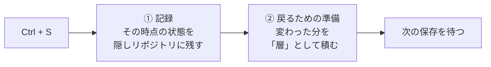

# MicroGit の仕組み

[ストアの説明文](../README-marketplace.md) では「保存すると自動で残り、あとから戻れる」と書きました。このページでは、それを支えている仕組みと、仕組みを知らないと分かりにくい利点を説明します。Git の基本（コミット・ブランチ）を知っている人向けです。

---

## 1. 保存のたびに、2 つのことをしている

| | すること | なぜ要るか |
|---|---|---|
| ① 記録 | 保存した状態を、Git と同じ形式で隠しリポジトリ（`.microgit/shadow`）に残す | 履歴の正本（いちばん正しい記録）。Git の形式なので、普通の Git の道具でも読める |
| ② 戻るための準備 | 変わったファイルだけを「層」として積んでおく | 過去に戻るとき、層を重ねるだけでその時点の姿を作れるようにする |

どちらも、VS Code が保存を終えたあとに裏で行います。エディタが MicroGit の処理を待つことはありません。

---

## 2. 普段の Git と混ざらない理由

MicroGit は、作業フォルダの中に、普段の `.git` とは別の隠しリポジトリを持っています。保存のたびのコミットはこちらに入るので、普段の `git log` や `git status` の履歴には出てきません。

- 記録の 1 件 1 件には、そのときの普段の Git の `HEAD`（`Main-Head`）が付いています。パネルの「メインコミット区間」は、これを使って「コミット A と B のあいだの記録」を選んでいます
- ブランチを切り替えると、MicroGit もそのブランチ専用の記録に切り替えます。ほかのブランチの記録は混ざりません
- ほかのパソコンと共有するときは、普段のリポジトリの `refs/microgit/<ブランチ>/` という特別な場所に履歴を載せて、`git push` / `git pull` で運びます。普段のブランチやタグには触りません

---

## 3. 記録が速い理由

保存 1 回の記録は、普通の Git の `git add` → `git commit` より短い時間で終わります（手元の Windows で、Git の 0.090 秒に対して 0.010 秒。電源が落ちても失わない設定を両方でそろえて比較）。中身は Git のコミットそのものなのに速いのは、次の 3 つの工夫のためです。

| 工夫 | 中身 |
|---|---|
| Git のプログラムを起動しない | `git commit` が中で書いているファイル（中身・フォルダの一覧・コミット・ブランチの指す先）を、拡張機能の中で Git と同じ形式で直接書く。Windows ではプログラムを 1 回起動するだけで数十ミリ秒かかるので、それが丸ごと無くなる |
| ディスクへの確定待ちは 1 回だけ | 保存 1 回で書くものを 1 つの記録（ジャーナル）にまとめて、そこでだけ確定を待つ。停電しても、次に起動したときにジャーナルから作り直す |
| Git の形式のファイルは、落ち着いてから書く | 保存の直後はジャーナルにだけ書き、Git の形式のファイルは保存が 0.3 秒落ち着いたときにまとめて書く |

詳しくは [保存が速くなった理由](./why-save-is-fast.md) に、MicroGit と Git のソースコードを並べて説明しています。

### 停電への備え

設定 `microgit.durability` の既定は `power` です。電源が落ちたり OS が異常終了したりしても、記録が終わった保存は失いません。`process` にすると、VS Code が落ちても失いませんが、電源断では直前の記録を失うことがあります（Git の既定と同じ）。

---

## 4. 過去に戻るのが速い理由（カーネル版）

### 4.1 層を重ねる

MicroGit は、保存ごとの変更を「層」として積んでいます。過去のある時点の姿は、その時点までの層を重ねるだけで作れます。

これは、Linux カーネルの **OverlayFS** という機能とほぼ同じ形です（Docker もこの機能を使っています）。そこで 5.0.0 からは、使えるパソコンでは本物の OverlayFS で層を重ねています。これを **カーネル版** と呼び、層の重ね方を JavaScript でまねた従来のやり方を **Node.js 版** と呼びます。

### 4.2 パソコンごとの動き方

| パソコン | 動き方 |
|---|---|
| Linux（カーネル 5.11 以降） | 仮想マシンは使わない。Linux に入っている OverlayFS を、管理者権限なしでそのまま使う |
| Windows（ふつうの Intel・AMD の PC） | 拡張機能に入っている小さな Linux を、同梱の QEMU（仮想マシンのソフト）で裏で動かす。管理者権限は要らない |
| Mac（Apple のチップ） | macOS に入っている仮想マシンの仕組み（Virtualization.framework）で、小さな Linux を動かす |
| それ以外（Intel の Mac、Arm の Windows など） | Node.js 版 |

Ubuntu 23.10 以降の既定のように、管理者権限なしで隔離された空間を作る機能（非特権のユーザー名前空間）が止められている Linux でも、Node.js 版になります。

**どのパソコンでも、カーネル版が使えなければ、何もしなくても Node.js 版に切り替わります。** 実際に小さな層を 1 枚作って捨てるところまで試してから使います。

### 4.3 小さな Linux の中身

仮想マシンの中に入っているのは、Linux カーネルと、命令を受けて実行する小さなプログラム（agent）の 2 つだけです。

- シェルが無いので、任意のプログラムは動かせません
- ネットワークの仕組みも入れていません。ホストとのやりとりは、仮想の線 1 本だけです
- 層は仮想マシンのメモリに置きます。履歴の正本はあくまで隠しリポジトリ（Git）で、層はいつでも作り直せる下書きのようなものです
- 仮想マシンが返したファイルは、必ずホストの上で検査してから作業フォルダに書きます（`.git` の中に書かない、作業フォルダの外に出ない、など）

小さな Linux の起動には 1 秒ほどかかりますが、最初の保存のときに裏で起動を始めるので、起動を待たされることはほとんどありません。

### 4.4 どれくらい速いか

同じパソコン（Windows 11）で、設定を切り替えて比べた例です（2026-10-09、保存 100 回の真ん中の値）。

| | カーネル版 | Node.js 版 |
|---|---|---|
| 保存 1 回の処理全体（記録と、戻るための準備） | 0.007 秒 | 0.165 秒 |
| 過去に戻る操作 | 0.51 秒 | 5.06 秒 |

測り方と、ほかのパソコンの値は [保存のときの律速段階の調査](./save-bottleneck-investigation.md) にあります。パソコンや履歴の大きさで値は変わります。

### 4.5 設定

| 設定 | 意味 |
|---|---|
| `microgit.overlayBackend` | `auto`（既定）：カーネル版を試し、だめなら Node.js 版。`kernel`：カーネル版を使い、だめなら理由を知らせる。`nodejs`：Node.js 版だけ |
| `microgit.kernel.accel` | Windows の仮想マシンの動かし方。`auto`（既定）、`whpx`（速い。Windows の機能「Windows ハイパーバイザー プラットフォーム」が要る）、`tcg`（遅いが、仮想化の機能も管理者権限も要らない） |
| `microgit.kernel.memoryMb` | 小さな Linux のメモリ（既定 256 MB）。大きなファイルを記録するときは増やす |

どちらで動いているかは、コマンド `MicroGit: Overlay Status` の先頭（`active=kernel` / `active=nodejs`）で分かります。

---

## 5. もっと詳しく

- 開発の記録（記事）：[保存ごとの自動コミットで、戻るときの待ち時間を縮めた](https://zenn.dev/usudonsdev/articles/microgit-v5-kernel-overlay)
- 設計の判断の一覧：[design-rationale.md](./design-rationale.md)
- 研究の現状：[research-status.md](./research-status.md)
