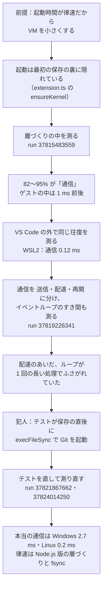
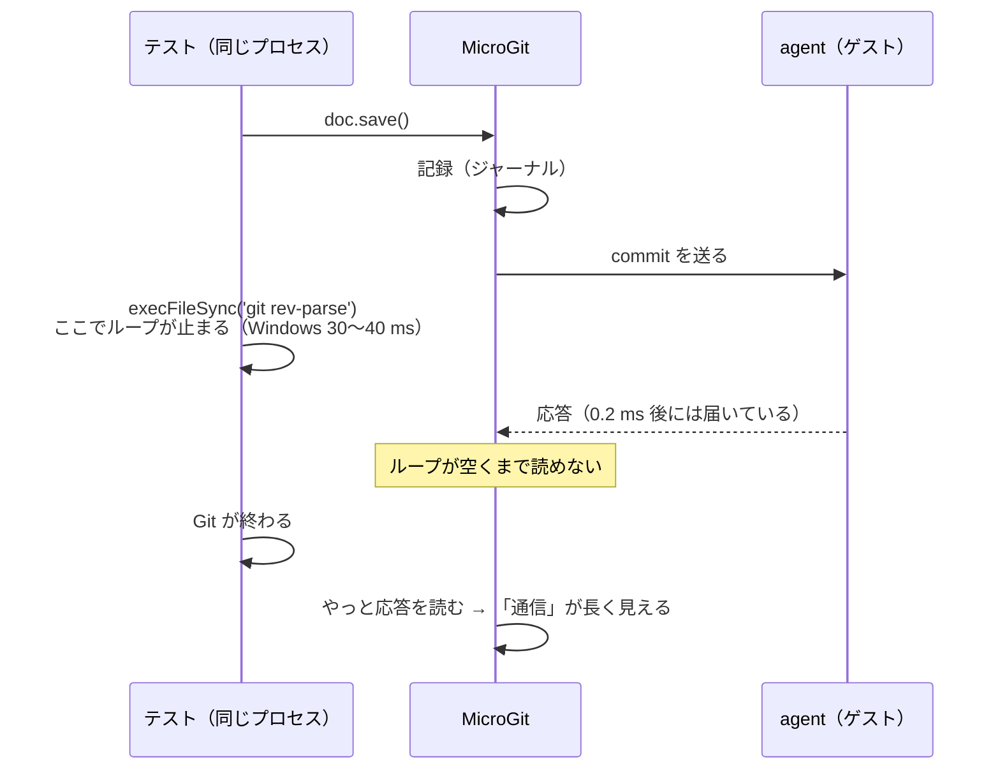
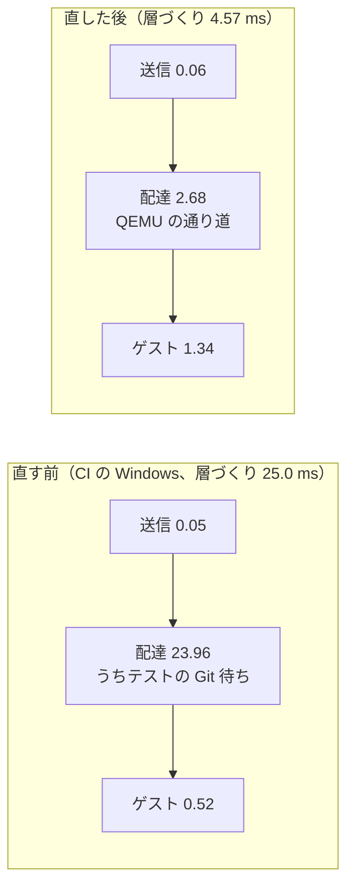

# 保存のときの律速段階の調査（#61）

| 項目 | 内容 |
|---|---|
| 目的 | 「VM を小さくすれば速くなる（起動時間が律速）」という前提が今も正しいかを確かめ、保存の処理の本当の律速段階を実測で決める |
| 版 | 初版（2026-10-09） |
| Issue | [#61](https://github.com/usudonsdev/microgit/issues/61) |
| 計測のコード | ブランチ `measure/61-layer-breakdown`（計測のための変更は master に入れない方針。利用者の判断、2026-10-09） |
| 生データ | [docs/paper/data/](./paper/data/README.md) の `ci-37815483559`・`ci-37819226341`・`ci-37821867662`・`ci-37824014250`・`local-win-61` |
| 関係 | [research-status.md](./research-status.md) §2.2（この調査で数字を直した）、[design-rationale.md](./design-rationale.md) §3.4、[学習用 12](./learning/12-measure-the-whole-path.md) |

---

## 1. 結論

1. **VM の大きさ・起動・OverlayFS の mount は、保存の律速ではない。** ゲストの中の処理（mount・書き込み・unmount を含む）は 1 ms 前後。起動は最初の保存の裏に隠れている
2. **これまで「層づくりの通信」と測っていた時間の大半は、計測に使っていたテストが作った待ちだった。** 拡張機能テストは拡張機能と同じプロセスで動く。保存の直後に `execFileSync` で Git を起動して HEAD を確かめていたので、その間（Windows で 30〜40 ms）拡張機能ホストのイベントループが止まり、MicroGit は agent の応答を読めなかった。利用者の保存では起きない
3. テストを直したあとの、VM との本当の通信は **Windows（QEMU）で約 2.7 ms、Linux（VM なし）で約 0.2 ms**
4. 保存 1 回の処理全体は、カーネル版の Linux で **3.3〜3.7 ms**、CI の Windows で 15.3 ms、手元の Windows で **7.3 ms**。合格の基準の予算（1 回 16 ms 以下を目標）に、カーネル版ではすでに収まっている
5. **同じ機械では、カーネル版は高速化後の Node.js 版より速い**（手元の Windows：保存 1 回 7.3 ms 対 165.3 ms、過去に戻る操作 513 ms 対 5,062 ms）
6. 今いちばん重いのは、**Node.js 版の層づくり**（CI で 15〜34 ms、手元の Windows で 157 ms）と、**Windows の記録の fsync**（CI で 5.3 ms）

---

## 2. 調べた順番

### 2.1 前提を疑う

VM を小さくする作業は「起動時間が律速段階」という前提で進めていた。ところが保存の処理を読むと、カーネル版がまだ起動していなければ裏で起動を始め、その回の層は Node.js 版で作っている（`src/extension.ts` の `ensureKernel`、[research-status.md](./research-status.md) §2.6 の「起動直後の最初の保存」は合格）。起動を待つのは、起動しきる前に「過去に戻る」を押したときだけ。

起動の時間（Mac 0.6 s、Windows WHPX 約 1.0 s、TCG 1.8 s、Linux 29 ms）は、保存の速さには効いていなかった。残っていた手がかりは、[research-status.md](./research-status.md) §2.2 の「保存の処理の中でいちばん重いのは層づくり（内訳は未計測）」だった。

### 2.2 層づくりの中を測る

層づくりを、ホストとゲストの両方で段階に分けた。

| 側 | 段階 | 測り方 |
|---|---|---|
| ホスト | prepare（op の組み立てと base64）・stage・往復 | `src/kernel/layerFeeder.ts` で `performance.now()` |
| ゲスト | prepare・mount・mountinfo（`/proc/mounts`）・ops・unmount・cleanup | agent の commit の応答に `phasesUs`（µs）を足した（agent 1.2.0） |
| 差 | 通信 = 往復 − agent の中の時間（`elapsedUs`） | |

CI の 5 環境（run 37815483559、保存 100 回の最後の 50 回の中央値、ms）：

| 環境 | 層づくり | 通信 | ゲストの中 | うち mount | うち unmount |
|---|---|---|---|---|---|
| Windows（QEMU、名前付きパイプ） | 33.71 | 31.99 | 0.95 | 0.15 | 0.05 |
| Ubuntu 22.04（VM なし） | 9.53 | 8.09 | 1.17 | 0.30 | 0.16 |
| Ubuntu 24.04 arm（VM なし） | 6.12 | 5.01 | 0.76 | 0.19 | 0.13 |

層づくりの 82〜95% が「通信」。ゲストの中は 1 ms 前後で、mount・unmount はそれぞれ 0.3 ms 以下だった。

### 2.3 VS Code の外で同じ往復を測る

VM を使わない Linux で、パイプの往復に 5〜8 ms は長すぎる。同じ往復を VS Code の外で測った（`scripts/bench-agent-rtt.mjs`、本物の `AgentConnection`、約 250 バイトのファイル、300 回の最後の 100 回の中央値）。

| 場所 | 往復 | うち agent の中 | 通信 |
|---|---|---|---|
| WSL2（`unshare -Urm`、VM なし） | 0.60〜0.64 ms | 0.48〜0.53 ms | **0.12 ms** |
| 手元の Windows（同梱の QEMU、名前付きパイプ） | 3.97〜3.99 ms | 0.19〜0.21 ms | **3.7 ms**（うち配達） |

VS Code の外では、Linux の通信は 0.12 ms しかない。VS Code の中の 5〜8 ms は、往復そのものではなかった。

### 2.4 通信をさらに分ける

通信を 3 つに分け、往復のあいだの拡張機能ホストのイベントループも測った。

| 名前 | 中身 |
|---|---|
| send | 要求の JSON を組み立てて書き出すまで |
| wire | 書き出してから、応答の行を受け取るまで（agent の中の時間を除く） |
| resume | 応答の行を受け取ってから、待っていた処理に戻るまで |
| loop.blocked・loop.maxGap | 往復のあいだ `setImmediate` を回し、ループの 1 周のすき間（0.5 ms 超の合計と最長）を測る |

run 37819226341 の結果（ms）：

| 環境 | 層づくり | wire | resume | loop.maxGap |
|---|---|---|---|---|
| Windows | 24.98 | 23.96 | 0.06 | 24.40 |
| Ubuntu 22.04 | 3.93 | 3.02 | 0.04 | 3.65 |
| Ubuntu 24.04 arm | 7.12 | 5.75 | 0.08 | 6.60 |

通信のほぼ全部が wire で、そのあいだループは **1 回の長い処理でふさがれていた**（loop.maxGap ≒ 往復全体）。agent はすぐ答えているのに、拡張機能ホストがほかの同期処理で手がふさがっていて、応答を読めていない。

### 2.5 ふさいでいたのはテストだった

CI のテストは、組み込みの Git 拡張を含め、ほかの拡張機能をすべて止めている（`src/test/runTest.ts`）。残るのは MicroGit とテスト自身。テストの保存の手順（`src/test/suite/overlayBackend.test.ts` の `editAndSave`）を読むと、保存の直後に `waitForNewHead` が `shadowHead()` を呼び、`execFileSync('git', ['rev-parse', 'HEAD'])` で **Git を同期で起動** していた。

テストは拡張機能と同じプロセス（拡張機能ホスト）で動くので、テストの同期処理は MicroGit の待ちとして測られる。Git の起動は Windows で 30〜40 ms、Linux で数 ms かかり、測った「待ち」の大きさと合う。

### 2.6 直して確かめる

| 手元の Windows、同じ VSIX、保存 100 回の最後の 20 回の中央値 | Git を同期で起動 | 非同期の `execFile` | Git を起動しない |
|---|---|---|---|
| 層づくり | 40.4 ms | 3.7 ms | **2.0 ms** |
| うち wire | 39.9 ms | 3.1 ms | **1.4 ms** |
| ループがふさがれた時間 | 40.2 ms | 3.3 ms | **0.0 ms** |
| 保存 1 回の処理全体 | — | 9.5 ms | **7.3 ms** |

非同期の `execFile` にしても、Linux の CI ではまだ 4〜7 ms 残った（run 37821867662）。子プロセスを作る瞬間（Linux では親のプロセスを複製する処理）は同期で動くためと見込む（この内訳は測っていない）。最後は、MicroGit に内部コマンド `microgit.internal.lastSave`（処理を終えた保存の数と、最後に記録したコミットを返す）を足し、テストは保存の最中に Git を一切起動しないようにした。

---

## 3. 直したあとの値

CI の 5 環境（run 37824014250、保存 100 回の最後の 50 回の中央値、ms。「前」は run 37819226341）：

| 環境 | 保存 1 回の処理全体 前 → 後 | 記録 | 層づくり 前 → 後 | 層の通信 | ループのふさがり |
|---|---|---|---|---|---|
| Ubuntu 22.04（カーネル版） | 5.9 → **3.3** | 1.0 | 3.9 → 1.35 | 0.17 | 0.00 |
| Ubuntu 24.04 arm（カーネル版） | 10.7 → **3.7** | 1.4 | 7.1 → 1.39 | 0.23 | 0.00 |
| Windows（カーネル版） | 33.3 → **15.3** | 7.4（うち fsync 5.3） | 25.0 → 4.57 | 2.78 | 1.49 |
| Ubuntu 24.04（Node.js 版） | 16.6 → 16.5 | 0.9 | 14.3 → 14.8 | — | — |
| macOS（Node.js 版） | 45.2 → 39.3 | 2.6 | 38.6 → 34.0 | — | — |

- カーネル版の Linux の通信 0.17〜0.23 ms は、VS Code の外の値（0.12 ms）とそろった
- Windows の通信 2.7 ms が、QEMU を通る本当の費用。CI の Windows は記録の fsync が 5.3 ms と大きい（クラウドの仮想マシンのディスク。[design-rationale.md](./design-rationale.md) §3.4 の #45 と同じ傾向）
- CI の macOS は Virtualization.framework を使えないので Node.js 版。Apple silicon の実機のカーネル版の値はまだ無い（[mac-kernel-measurement-instructions.md](./mac-kernel-measurement-instructions.md)）

---

## 4. カーネル版と Node.js 版（同じ機械）

CI では、カーネル版（Ubuntu 22.04・24.04 arm・Windows）と Node.js 版（Ubuntu 24.04・macOS）が別の機械で動くので、手元の Windows で設定 `microgit.overlayBackend` を切り替えて比べた（同じコード、保存 100 回の最後の 20 回の中央値）。

| 手元の Windows 11 | カーネル版 | Node.js 版 |
|---|---|---|
| 保存 1 回の処理全体 | **7.3 ms** | 165.3 ms |
| うち層づくり | 2.0 ms | 157.1 ms |
| うち記録 | 2.6 ms | 3.3 ms |
| 過去に戻る操作（10 回の中央値） | **513 ms** | 5,062 ms |

保存 1 回で約 23 倍、過去に戻る操作で約 10 倍、カーネル版が速い。記録（ジャーナル）は両方に共通なので差が無い。差のほとんどは層づくりで、Node.js 版（`src/overlay.ts` の `exportCommitLayer`）は保存のたびに次のことをしている。

- `git diff-tree` を起動して、変わったファイルを調べる（`listCommitChanges`）
- 変わったファイルごとに `git cat-file blob` を **同期で**（`execFileSync`）起動して中身を読む
- その前に、ADR-0015 で「落ち着いてから書く」ことにした Git のファイルを、その場で書き出させる（`flushPendingGitWrites`）

カーネル版は #37 で、記録の処理が知っている「親からの変化」をそのまま agent に渡すようにしたので、Git を起動しない（`ensureFromDelta`）。Node.js 版にはこの近道がまだ無い。

言えないこと：
- これは 1 台の Windows の値。Linux では CI の別の機械どうしで、カーネル版 3.3〜3.7 ms・Node.js 版 16.5 ms（Ubuntu 22.04 と 24.04 のランナー）
- 過去に戻る操作は、テストのコマンド（`microgit.jumpToCommit`）の全体の時間で、[記事](../articles/microgit-v5-kernel-overlay.md) の「0.17 秒」（`scripts/bench-backends.mjs`、ワークスペースへの反映まで）とは測っている範囲が違う

---

## 5. 何が変わったか（前の結論の訂正）

| 前に書いていたこと | 訂正 |
|---|---|
| 保存の処理の中でいちばん重いのは層づくり（Windows 35.1 ms、Linux 7.5 ms。research-status.md §2.2） | テストの Git 待ちを含んでいた。直すと Windows 4.6 ms、Linux 1.4 ms |
| 層づくりの大半は通信と mount・unmount と見込む | mount・unmount はそれぞれ 0.3 ms 以下。通信も、本当は Windows 2.7 ms・Linux 0.2 ms |
| VM を小さくすれば速くなる | 起動も VM の大きさも、保存の律速ではない |

#37 以降の CI と手元の「層の作成」「保存 1 回の処理全体」の値は、どれもこの待ちを含んでいた見込み。記録（コミット）の値は、保存の処理のうち先に終わる部分なので、影響は小さいと見込む（未確認）。

---

## 6. 次にやること

| 候補 | 今の値 | 見込み |
|---|---|---|
| Node.js 版の層づくり | CI 15〜34 ms、手元の Windows 157 ms | 効果がいちばん大きい。#37 でカーネル版にしたのと同じく「親からの変化」を使えば、Git の起動と、遅らせた書き出しの強制をやめられる見込み。同期の `execFileSync` は拡張機能ホストのループも止めるので、「保存のときに気づかない」の基準にも直接効く |
| Windows の記録の fsync | CI 5.3 ms（手元は小さい） | ディスクしだい。ジャーナル 1 回の fsync までは減らしてある（ADR-0014） |
| QEMU との通信 | 約 2.7 ms | 小さい。microvm・virtio-mmio などは、ほかを削ってから |
| Apple silicon の実機のカーネル版 | 未計測 | Mac は 1 行 48 KB の上限のため、保存のたびに stage と commit で往復が 2 回以上ある。[指示書](./mac-kernel-measurement-instructions.md) |
| テストの修正を master に入れるか | 計測用ブランチだけ | 入れないと、master の CI の保存の数字は今後もテストの待ちを含む（利用者の判断待ち） |

---

## 7. 学んだこと

- **測る道具も、測られる側と同じ場所で動いていれば、結果に混ざる。** VS Code の拡張機能テストは拡張機能ホストで動く。テストの同期処理（`execFileSync`、`spawnSync`、大きな `readFileSync` など）は、拡張機能の待ちとして測られる
- **外と中で同じものを測ると、混ざりものが分かる。** 同じ往復を VS Code の外で測ったことで、「通信が遅い」のではなく「中で読めていない」と分かった
- **合計だけでなく「待っている間、何が起きていたか」を測る。** ループのすき間（loop.maxGap）が往復とほぼ同じだったことが、決め手になった
- **非同期にしても、子プロセスの起動の瞬間は同期。** Linux の CI では、非同期の `execFile` でもループが数 ms 止まった（親のプロセスの複製と見込む。内訳は未計測）
