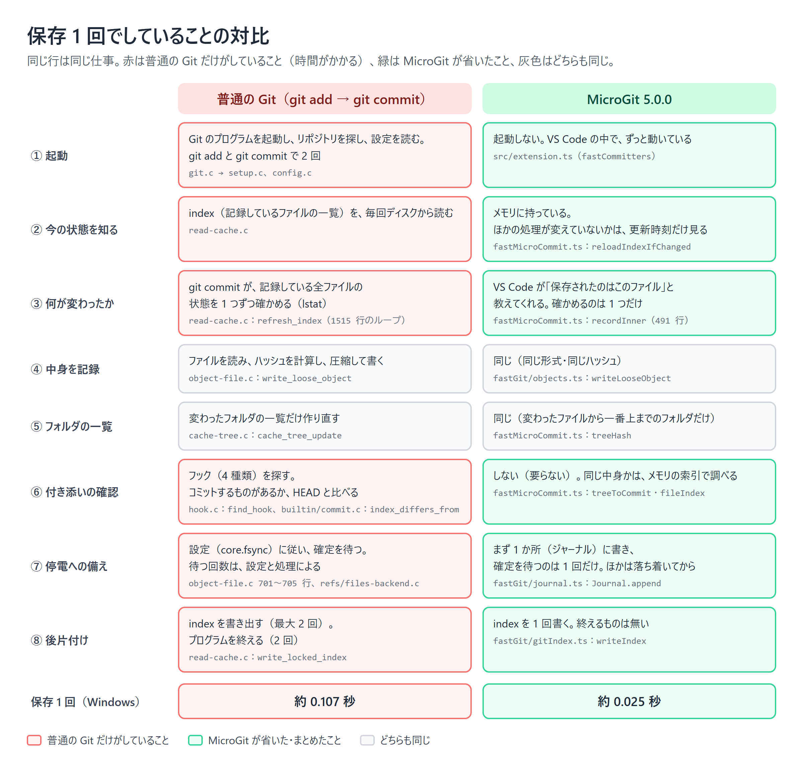

# 保存が速くなった理由：MicroGit と Git のソースコードの対比

| 項目 | 内容 |
|---|---|
| 読む人 | MicroGit の保存の仕組みを理解したい人。記事・論文の下書きの材料 |
| 前提にする知識 | Git の基本操作（add・commit）。Git の内部の知識は前提にしない |
| 比べる Git | Git 2.50.0（手元の計測と同じ版）。ソースは [git/git の v2.50.0](https://github.com/git/git/tree/v2.50.0) |
| 関係 | [学習用 11 回](./learning/11-writing-git-from-inside.md)（Git を内側から書く）、[14 回](./learning/14-write-ahead-journal.md)（ジャーナル）、[ADR-0014](./adr/0014-journal-single-fsync.md)、#32、#38、#49 |

---

## 1. 結論

MicroGit は、保存 1 回で **普通の Git と同じファイル**（同じ形式・同じハッシュ）を書きます。違うのは、そこに至るまでの道のりです。

| 保存 1 回を記録する時間（Windows 11、ファイル 200 個） | 時間 |
|---|---|
| MicroGit 4（Git のコマンドを 16 回起動、履歴 10 回のとき） | 約 0.55 秒（履歴 1,000 回で 2.4 秒） |
| 普通の Git（`git add` → `git commit`） | 約 0.107 秒 |
| MicroGit 5.0.0 | 約 0.025 秒 |
| **MicroGit（#49 の後、ADR-0015）** | **約 0.010 秒**（同じ日に測った普通の Git は約 0.090 秒） |

普通の Git と MicroGit は、停電対策の設定をそろえて比べています（[5.0.0 のデータ](./paper/data/micro-commit-journal-vs-git-win32-power.json)、[#49 の後のデータ](./paper/data/micro-commit-deferred-vs-git-win32-power.json)。同じ PC でも日によって Git の時間が違うので、比べるときは同じ日の行どうしで）。MicroGit 4 の行は、条件がそろっていない参考値です（[データ](./paper/data/micro-commit-baseline-win32.json)。停電対策あり。比べた Git は停電対策なしで約 0.08 秒）。

速くなった理由は、次の図の赤い行（Git だけがしていること）を省いたか、まとめたかです。灰色の行（中身を記録する、フォルダの一覧を作る）は、どちらもほとんど同じことをしています。



以下、行ごとに、両方のソースコードを並べて見ます。

---

## 2. ① 起動：プログラムを起動しない

### Git

`git add` も `git commit` も、別のプログラムです。呼ぶたびに、OS がプロセスを作り、Git は自分のリポジトリを探し（`setup.c`）、設定ファイルを PC 全体・ユーザー・リポジトリの 3 か所から読みます（`config.c`）。保存 1 回で `git add` と `git commit` の 2 回です。

Windows はプロセスを作るのが特に重く、1 回あたり数十ミリ秒かかります。MicroGit 4 は保存 1 回で Git を 16 回起動していて、これだけで 0.5 秒近くになっていました。

### MicroGit

MicroGit は VS Code の拡張機能として、VS Code が開いている間ずっと動いています。Git のファイルを読み書きする部品（`FastMicroCommitter`）を、リポジトリごとに 1 つ作って使い回します。

```ts
// src/extension.ts（recordMicroCommit）
let fc = fastCommitters.get(gitDir);
if (!fc) {
    fc = new FastMicroCommitter(input.shadowRepoPath, () => getDurability() === 'power');
    fastCommitters.set(gitDir, fc);
}
const out = fc.record(input);   // プロセスを起動せず、同じプロセスの中で記録する
```

---

## 3. ② 今の状態を知る：メモリに持っておく

### Git

Git は、コマンドが終わるたびに全部を忘れます。次のコマンドは、index（記録しているファイルの一覧）をディスクから読み直します（`read-cache.c`）。

### MicroGit

MicroGit は、前回の記録のあとの状態（index、フォルダの一覧、履歴の索引）をメモリに持っています。ほかの処理（過去に戻る操作など）が index を書き換えていないかは、**ファイルの更新時刻と大きさだけ** を見て判断し、変わっていたときだけ読み直します。

```ts
// src/fastMicroCommit.ts:205
private reloadIndexIfChanged(): void {
    const now = stamp(indexPath(this.gitDir));               // 更新時刻・大きさなど
    if (this.loaded && sameStamp(now, this.indexStamp)) { return; }   // 変わっていなければ読まない
    this.index = readIndex(indexPath(this.gitDir));
    ...
}
```

---

## 4. ③ 何が変わったか：全部を確かめない

ここが、Git との差がいちばん大きく出る場所です。

### Git

Git は、どのファイルが変わったかを知りません。`git commit` は、index に載っている **全ファイル** について、`lstat`（ファイルの更新時刻や大きさを OS に聞く）を 1 つずつ呼んで確かめます（refresh）。ファイルが 200 個なら 200 回、2 万個なら 2 万回です。

```c
/* read-cache.c:1515（refresh_index）— index の全エントリを回る */
for (i = 0; i < istate->cache_nr; i++) {
    ...
    new_entry = refresh_cache_ent(istate, ce, options, &cache_errno, &changed, ...);

/* read-cache.c:1377（refresh_cache_ent）— 1 つずつ OS に聞く */
if (lstat(ce->name, &st) < 0) {
    ...
}
changed = ie_match_stat(istate, ce, &st, options);
```

（[read-cache.c:1515](https://github.com/git/git/blob/v2.50.0/read-cache.c#L1515)、[read-cache.c:1377](https://github.com/git/git/blob/v2.50.0/read-cache.c#L1377)。`git commit` の [builtin/commit.c:472](https://github.com/git/git/blob/v2.50.0/builtin/commit.c#L472) の `refresh_cache_or_die` から呼ばれる）

### MicroGit

VS Code は、保存したときに「保存されたのはこのファイル」と拡張機能に教えてくれます。MicroGit は、そのファイル 1 つだけを確かめて読みます。

```ts
// src/fastMicroCommit.ts:491（recordInner）
// git add -- <rel>
const abs = path.join(this.workTree, ...rel.split('/'));
const st = fs.lstatSync(abs);           // 確かめるのは、保存されたファイルだけ
...
const content = fs.readFileSync(abs);
const blob = this.stageObject('blob', content);
```

ファイルの数が増えても、保存 1 回の手間は増えません。

---

## 5. ④ 中身を記録、⑤ フォルダの一覧：ここは同じ

ファイルの中身を読み、ハッシュ（SHA-1）を計算し、圧縮して書く部分は、Git と同じです。結果も 1 ビット違わず同じでなければいけません（§9）。

| | Git | MicroGit |
|---|---|---|
| 中身を書く | `object-file.c` の `write_loose_object` | `src/fastGit/objects.ts` の `writeLooseObject` |
| フォルダの一覧を作る | `cache-tree.c` の `cache_tree_update`（変わったフォルダだけ作り直す） | `src/fastMicroCommit.ts:313` の `treeHash`（変わったファイルから一番上までのフォルダだけ作り直す） |
| コミットを作る | `commit.c:1690` の `commit_tree_extended` | `src/fastGit/objects.ts` の `serializeCommit` |

フォルダの一覧も、Git は「cache-tree」という仕組みで、変わっていないフォルダの計算を省いています。MicroGit も同じ考え方です（フォルダごとにハッシュを覚えておき、変わったファイルの上のフォルダだけ消す）。

```ts
// src/fastMicroCommit.ts:313
private treeHash(d: Dir, write: boolean): string {
    if (d.hash) { return d.hash; }    // 変わっていないフォルダは、覚えているハッシュを使う
    ...
}
// recordInner の中：保存したファイルから一番上までのフォルダだけ、覚えているハッシュを消す
for (const x of chain) { x.hash = undefined; }
```

---

## 6. ⑥ 付き添いの確認：要らないことはしない

### Git

`git commit` は、利用者のスクリプトを動かす仕組み（フック）に対応するため、4 種類のフック（pre-commit、prepare-commit-msg、commit-msg、post-commit）を探します。探すたびに `access` で OS に聞き、見つからなければ、Windows では拡張子 `.exe` を付けてもう 1 回聞きます（Windows 版のビルド設定 `config.mak.uname` が `STRIP_EXTENSION=".exe"` を付けている）。

```c
/* hook.c:13（find_hook） */
repo_git_path_replace(r, &path, "hooks/%s", name);
found_hook = access(path.buf, X_OK) >= 0;
#ifdef STRIP_EXTENSION                  /* Windows：.exe を付けて、もう 1 回 */
    ...
    found_hook = access(path.buf, X_OK) >= 0;
```

また、コミットするものがあるかを、index と HEAD を比べて確かめます（[builtin/commit.c:1041](https://github.com/git/git/blob/v2.50.0/builtin/commit.c#L1041) の `index_differs_from`）。

### MicroGit

マイクロ履歴にフックは要りません。「前と同じ中身か」は、メモリの索引（フォルダの一覧のハッシュ → コミット）を引くだけで分かります。

```ts
// src/fastMicroCommit.ts:536
const headTree = this.commitTree.get(currentHead);
if (headTree === tree) {          // HEAD と同じ一覧なら、記録しない
    this.applyTxn();
    return { kind: 'unchanged' };
}
const byTree = this.treeToCommit.get(tree);    // 過去に同じ一覧があれば、そこに戻す
```

MicroGit 4 では、この「過去に同じ中身があったか」を調べるのに、保存のたびに履歴全体を Git に読ませていました。履歴が 1,000 回になると、保存 1 回に 2.4 秒かかっていました（#32）。今は、起動して最初の 1 回だけ履歴を読んで索引を作り、あとは記録のたびに足していきます。

---

## 7. ⑦ 停電への備え：確定待ちを 1 回に

### Git

Git は、設定（`core.fsync`）に従って、書いたファイルがディスクに届くのを待ちます（fsync）。まとめて待つ工夫（`core.fsyncMethod=batch`）もあります。

```c
/* object-file.c:700（close_loose_object） */
if (batch_fsync_enabled(FSYNC_COMPONENT_LOOSE_OBJECT))
    fsync_loose_object_bulk_checkin(fd, filename);     /* まとめて待つ */
else if (fsync_object_files > 0)
    fsync_or_die(fd, filename);                         /* 1 つずつ待つ */
else
    fsync_component_or_die(FSYNC_COMPONENT_LOOSE_OBJECT, fd, filename);
```

ただ、`git add` と `git commit` は別々のプログラムなので、それぞれが自分の書いたものを確定させます。ブランチの書き換え（`refs/files-backend.c`）も別に確定させます。

### MicroGit

MicroGit は、保存 1 回で書くもの全部（ファイルの中身、フォルダの一覧、コミット、ブランチの指す先）を、まず **1 つの記録にまとめてジャーナルに書き、確定を 1 回だけ待ちます**。Git の形式のファイルは、確定を待たずに書き、保存が落ち着いてからまとめて確定させます。停電したら、次に起動したときにジャーナルから作り直します（[ADR-0014](./adr/0014-journal-single-fsync.md)）。

```ts
// src/fastMicroCommit.ts:370（applyTxn）
if (journalMode && ...) {
    this.journal.append({ objects: ..., refs: ..., head: t.head });   // ここで 1 回だけ確定を待つ
}
for (const [hash, o] of t.objects) {
    writeLooseObject(this.gitDir, o.type, o.body, { fsync: false, ... });   // 待たずに書く
}
writeIndex(...); writeRef(...);   // これも待たずに書く
```

保存 1 回の確定待ちは 7 回から 1 回になり、CI の Windows では記録の時間が 0.070 秒から 0.021 秒になりました。

### さらに：Git の形式のファイルは、落ち着いてから書く（ADR-0015）

確定を待たなくても、Windows ではファイルを 1 つ作るたびに時間がかかります（保存 1 回で 7 つ前後、合わせて約 0.017 秒）。そこで今は、保存のときは **ジャーナルに書いて確定させるだけ** にし、Git の形式のファイルはメモリに貯めておいて、保存が 0.3 秒落ち着いたときにまとめて書き出します。何回分かをまとめて書き出すと、ブランチのファイルは最後の値を 1 回書くだけで済みます。

```ts
// src/fastMicroCommit.ts（applyTxn）
this.journal.append({ objects: ..., refs: ..., head: t.head });   // 確定を待つのはここだけ
if (this.deferWrites) {
    this.stash(t);       // Git の形式のファイルは書かずに貯める
    return;
}
```

隠しリポジトリを Git のコマンドなどで読む処理は、読む前に必ず「関所」（`src/fastGit/pendingWrites.ts` の `flushPendingGitWrites`）を通り、貯めている分を書き出させます。停電しても、ジャーナルから作り直せます。

---

## 8. ⑧ 後片付け

`git add` と `git commit` は、それぞれ index を書き出し（[read-cache.c:3311](https://github.com/git/git/blob/v2.50.0/read-cache.c#L3311) の `write_locked_index`。`git commit` は変わっていなければ省く）、プログラムを終えます。MicroGit は index を 1 回書くだけです（`src/fastGit/gitIndex.ts` の `writeIndex`）。

---

## 9. 同じ結果になることの確かめ方

速くても、普通の Git と違うものを書いてしまっては意味がありません。Git のファイルの名前は **中身から計算したハッシュ** なので、中身が 1 ビットでも違えば、コミットの名前も変わります。

`scripts/test/micro-commit-diff.mjs` は、同じ保存の列を「Git のコマンドで記録する版」と「MicroGit の速い版」の両方に流し、毎回次を比べます。

- 最後のコミットの名前（ハッシュ）
- ブランチ・タグ・index
- Git の整合性の検査（`git fsck --strict`）が通るか

CI で毎回、保存 300 回（改行が CRLF のファイルでは 150 回）を流しています。

同じにするために、Git に合わせた細かい点：

| 合わせたこと | 内容 |
|---|---|
| フォルダの一覧の並び順 | フォルダは、名前の後ろに `/` を付けたものとして並べる |
| ファイルの種類の数字 | 普通のファイルは `100644`、実行できるファイルは `100755` |
| 時刻 | 秒とタイムゾーン（`+0900` の形） |
| index の形式 | Git が読み書きする版（v2・v3）と、各エントリの更新時刻など |

MicroGit が扱えない設定のリポジトリ（SHA-256 のリポジトリ、新しい形式の ref、コミットの署名、改行の変換など）では、自分で書かずに Git のコマンドに切り替えます（`FastPathUnsupported`）。

---

## 10. 残っている時間の内訳

**#49（ADR-0015）の後**：保存のときにすることは、保存されたファイルを読む・計算する・ジャーナルに書いて確定させる、だけになりました（`node scripts/bench-commit-phases.mjs` の defer、手元の Windows で合計約 0.003〜0.006 秒）。下の表は、その前（5.0.0）の内訳です。Git の形式のファイルを作る約 0.017 秒は、今は保存が落ち着いてからの書き出しに移っています。

5.0.0 の内訳（ファイル 50 個、保存 200 回の平均。合計は約 0.022〜0.024 秒で、§1 の表とは条件が少し違う）：

| 段階 | 時間 |
|---|---|
| Git の形式のファイルを作る（中身・一覧・コミット） | 約 0.009 秒 |
| ブランチ・タグ・その履歴を書く | 約 0.005 秒 |
| index を書く | 約 0.002 秒 |
| 保存されたファイルを読む | 約 0.003 秒 |
| ジャーナルに書いて、確定を 1 回待つ | 約 0.001 秒 |
| 計算（ハッシュ、一覧、索引） | 約 0.002 秒 |

いちばん大きかったのは、Windows で **ファイルを作ること自体** でした（合わせて約 0.017 秒）。#49 で、これを保存が落ち着いてからの書き出しに移しました。

---

## 11. 手を動かして確かめる

```sh
npm run compile
# 普通の Git と、停電対策をそろえて比べる（保存 300 回）
node scripts/bench-micro-commit.mjs --impls fast,git --durability power --saves 300 --checkpoints 100,300
# MicroGit の段階ごとの時間
node scripts/bench-commit-phases.mjs
# Git のコマンドで記録した結果と 1 ビット一致するか
node scripts/test/micro-commit-diff.mjs --saves 300
```

Git のソースを読むときは、[builtin/commit.c の cmd_commit](https://github.com/git/git/blob/v2.50.0/builtin/commit.c#L1677) から始めて、`prepare_index` → `refresh_cache_or_die` → `cache_tree_update` → `commit_tree_extended` → `update_head_with_reflog` の順に追うと、この文書の ③〜⑧ と対応します。
